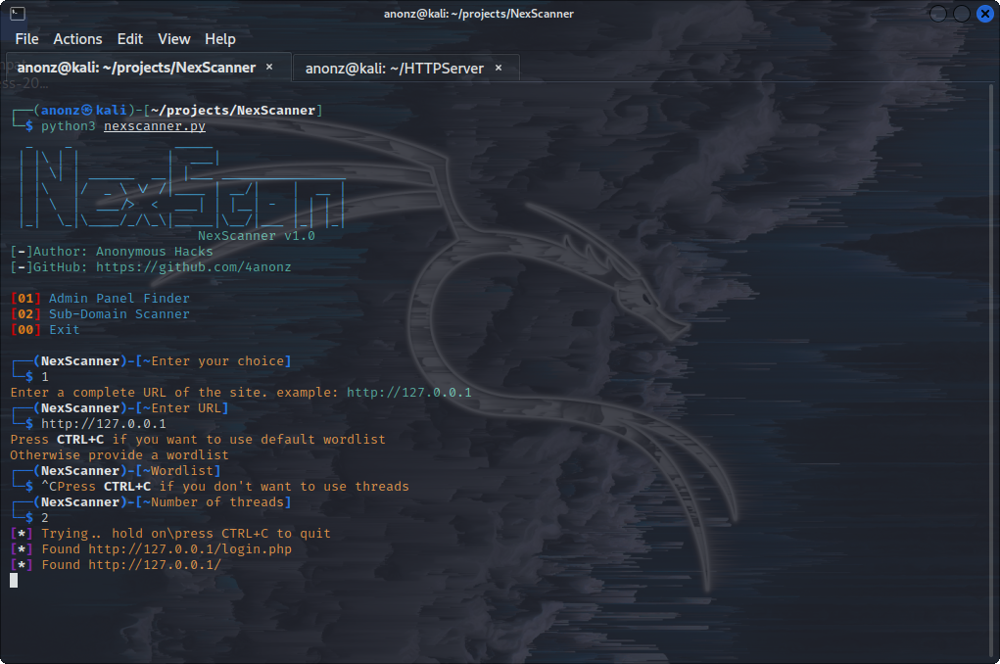

# NexScanner
NexScanner is a tool which helps you scan a website for sub-domains and also to find
login pages in the website like the admin login panel page.

# Installation
Use this commands to install both on linux and termux
```
git clone https://github.com/4anonz/NexScanner
cd NexScanner
pip3 install -r requirements.txt
python3 nexscanner.py
```
# Screenshots


# Author
Anonymous Hacks(4anonz)
Pleas leave a star
